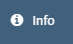
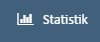
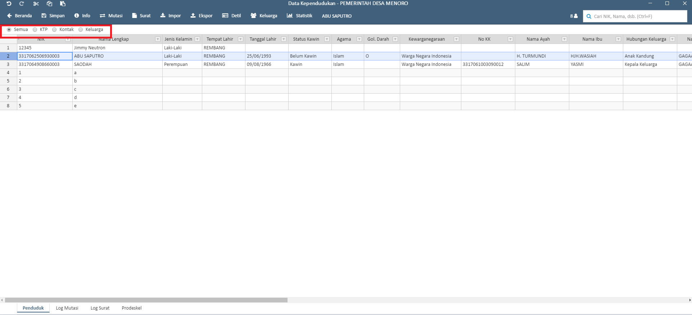
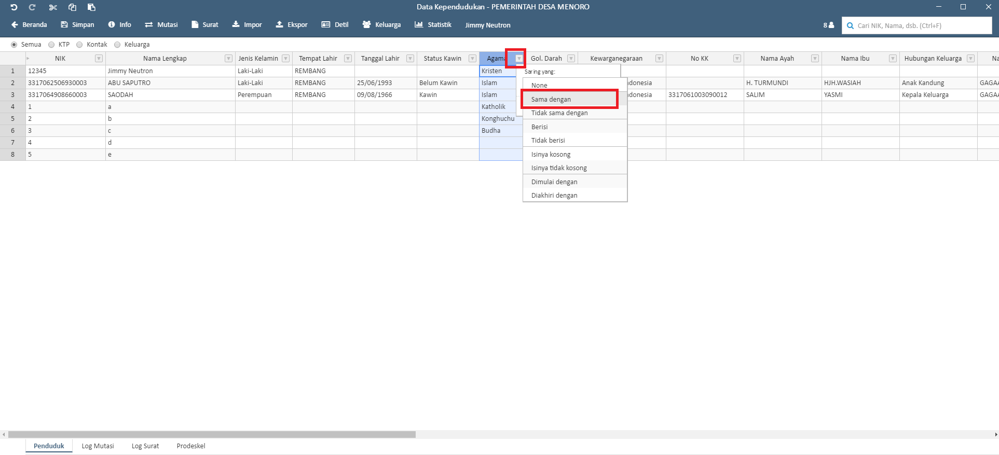
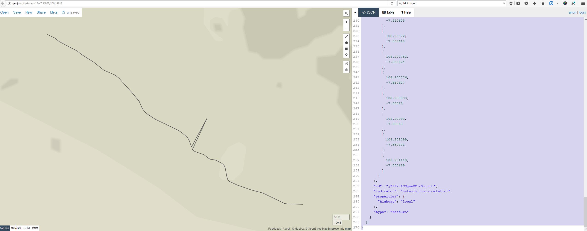
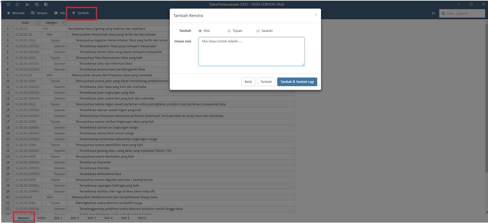

-------------------------
Panduan Sideka Desktop
-------------------------

Installasi aplikasi sideka
==========================

Untuk installasi sideka download terlebih dahulu aplikasi sideka di http://sideka.id, dan klik  **“unduh sekarang”** beikut tampilannya: 

.. figure:: images/sidekadesktop/download-sideka-desktop.png
   :alt: Halaman Download Sideka Desktop
   :align: center
   
   Gambar 1 Halaman Download Sideka Desktop.

Double klik aplikasi sideka yang telah di download, aplikasi akan langsung terbuka dan membuat shortcut pada desktop. berikut tampilan aplikasi sideka:

.. figure:: images/sidekadesktop/halaman-utama-sideka-desktop.png
   :alt: Halaman Utama Sideka Desktop
   :align: center
   
   Gambar 2 Halaman Utama Sideka Desktop.

Untuk membuka kembali sideka dapat meng-klik shortcut aplikasi sideka pada desktop.

Login
=====
Untuk dapat login sideka desktop, username dan password yang digunakan sama dengan username dan password untuk login ke sideka wordpress.  Berikut tampilan halaman login sideka desktop: 

.. figure:: images/sidekadesktop/login-sideka-desktop.png
   :alt: Login Sideka Desktop
   :align: center
   
   Gambar 3 Login Sideka Desktop

Masukan username dan password, dan klik **“log masuk”** untuk login, jika lupa password dapat mengklik **“Kehilangan password Anda?”**, berikut halaman utama sideka jika berhasil login:

.. figure:: images/sidekadesktop/halaman-administrator-sideka-desktop.png
   :alt: Halaman Administrator Sideka Desktop
   :align: center
   
   Gambar 4 Halaman Administrator Sideka Desktop.
   
Terdapat 4 Modul Utama Pada Sideka Desktop yaitu 
    * Kependudukan
    * Pemetaan
    * Keuangan (Perencanaan, Penganggaran, & Penatausahaan)
    * Pengguna

Kependudukan
========================
Untuk Masuk Ke menu Kependudukan Klik menu “Data Penduduk” pada halaman utama sideka, Berikut Tampilah Halaman Pengelolaan Data Penduduk:

.. figure:: images/sidekadesktop/halaman-pengelolaan-kependudukan.png
   :alt: Halaman Pengelolaan Kependudukan
   :align: center
   
   Gambar 5 Halaman Pengelolaan Kependudukan. 

.. |beranda| image:: images/sidekadesktop/beranda.png    
   :scale: 50%
   :align: middle
.. |simpan| image:: images/sidekadesktop/simpan.png
   :scale: 50%
   :align: middle

.. |mutasi| image:: images/sidekadesktop/mutasi.png
   :scale: 50%
   :align: middle
.. |surat| image:: images/sidekadesktop/surat.png
   :scale: 50%
   :align: middle
.. |import| image:: images/sidekadesktop/import.png
   :scale: 50%
   :align: middle
.. |export| image:: images/sidekadesktop/export.png
   :scale: 50%
   :align: middle
.. |detil| image:: images/sidekadesktop/detil.png
   :scale: 50%
   :align: middle
.. |keluarga| image:: images/sidekadesktop/keluarga.png
   :scale: 50%
   :align: middle

.. |redo| image:: images/sidekadesktop/redo.png
   :scale: 50%
   :align: middle
.. |cut| image:: images/sidekadesktop/cut.png
   :scale: 50%
   :align: middle
.. |copy| image:: images/sidekadesktop/copy.png
   :scale: 50%
   :align: middle

|beranda| : Tombol Kembali ke halaman utama.

|simpan| : Untuk Menyimpan Data Penduduk .

|info| : Untuk melihat info file, versi dan perubahan lokal.

|mutasi| : Untuk melakukan mutasi (pindah datang, pindah pergi, kelahiran, kematian) penduduk.

|surat| : Untuk Membuat berbagai surat terkait kependudukan.

|import| : Import Excel data kependudukan dari penyimpanan lokal ke sistem SiDeKa Desktop.

|export| : Export data kependudukan kedalam penyimpanan lokal dalam bentuk excel.

|detil| : Untuk melihat detil data penduduk berdasarkan penduduk yang dipilih.

|keluarga| : Untuk melihat data keluarga penduduk yang masih dalam 1 nomor kartu kerluaga 

|statistik| : Untuk melihat statistik kependudukan dalam satu desa.

|undo| : Undo / Mengembalikan Data ke sebelum di edit 

|redo| : Redo / Mengembalikan Data ke setelah di edit

|cut| : Cut / Memindahkan Data yang dipilh

|copy| : Copy / Menggandakan data yang dipilih 

|paste| : Paste / menempelkan data hasil cut atau copy 

1.1 Import dan Export  data penduduk
------------------------------------

.. |browse| image:: images/sidekadesktop/browse.png
   :scale: 50%
   :align: center

Untuk melakukan import data dapat mengklik tanda |browse| atau mengklik tanda |import| Untuk meng-import data dari Microsoft excel, lalu akan diarahkan untuk memilih berkas, berikut tampilan pemilihan berkas yang akan di import: 

.. figure:: images/sidekadesktop/pilih-berkas-data-penduduk.png
   :alt: Halaman Pemilihan Berkas Data Penduduk
   :align: center
   
   Gambar 6 Halaman Pemilihan Berkas Data Penduduk.

Setelah di pilih maka akan muncul tampilan untuk konfirmasi import, berikut tampilan konfirmasi import data penduduk :

Tombol Batal untuk membatalkan impor data, tombol Impor untuk mengimpor data, tombol Impor & Hapus Data Lama untuk mengimpor dan menghapus data lama atau data yang sebelumnya pernah di impor atau pernah di input, dan tombol Impor & gabungkan untuk mengimpor data dan menggabungkan dengan data yang sebelumnya di impor atau di input. Berikut adalah hasil import dari excel: 

.. figure:: images/sidekadesktop/tabel-data-penduduk.png
   :alt: Tabel Data Penduduk
   :align: center
   
   Gambar 7 Tabel Data Penduduk.

Jika sudah melakukan Import data Klik “Simpan” untuk menyimpan data atau berkas.
Data yang telah di import dapat di export  kembali menjadi file dengan format .xlsx, untuk meng- export dapat mengklik tanda |export| yang terdapat pada bagian atas, dan akan muncul halaman untuk menyimpan file seperti berikut:

.. figure:: images/sidekadesktop/simpan-data-penduduk.png
   :alt: Halaman Penyimpanan Berkas Data Penduduk
   :align: center
   
   Gambar 8 Halaman Penyimpanan Berkas Data Penduduk.

Masukan nama file, dan klik **“Save”** untuk menyimpan file

1.2 Tambah data penduduk
------------------------

Untuk menambahkan data penduduk dapat klik kanan pada baris data kependudukan, kemudian pilih **insert row above"** tampilannya seperti berikut: 

.. figure:: images/sidekadesktop/tambah-baris-data-penduduk.png
   :alt: Halaman Penambahan Baris Data Penduduk
   :align: center
   
   Gambar 9 Halaman Tambah Data Penduduk.

Sistem akan menampilkan baris kosong yang kemudian dapat diisi dengan data penduduk baru. Klik tombol **"simpan"** untuk menyimpan perubahan. 

Data penduduk yang telah ditambahkan dapat dihapus dengan cara klik pada nomor baris yang akan di hapus lalu klik kanan pada baris tersebut dan klik **“remove row”** untuk menghapus berikut tampilannya: 

.. figure:: images/sidekadesktop/hapus-baris-data-penduduk.png
   :alt: Halaman Hapus Baris Data Penduduk
   :align: center
   
   Gambar 10 Halaman Hapus Baris Data Penduduk.

1.3 Pembuatan surat
-------------------

Pembuatan surat dapat di lakukan dengan cara mengklik data penduduk yang akan dibuatkan surat, dan klik **"surat"** untuk pembuatan surat, berikut tampilannya: 

   
   Gambar 11 Halaman Cara Cetak Surat.

Pilih dan klik template surat yang diinginkan kemudian isi form yang diperlukan. setelah selesai klik Cetak untuk menyimpan surat dalam bentuk Word.

   
   Gambar 12 Halaman Isi Surat.

Masukan nama file dan klik **“save”** untuk menyimpan berkas. 

   
   Gambar 13 Halaman Cetak Surat.

1.4 Filtering dan pencarian data penduduk
-----------------------------------------

Untuk Filtering memiliki 2 cara, cara yang pertama dapat  mengklik  tombol ktp, kontak, keluarga yang terdapat pada radio button bagian atas. Berikut tampilan untuk filtering berdasarkan kontak: 

   
   Gambar 14 Halaman Filering Dengan Tombol.

Cara yang kedua yaitu dapat mengklik pada kolom header, berikut contoh dilter data kependudukan yang beragama Islam: 

   
   Gambar 15 Filtering Data Penduduk Dengan Kolom.

Klik sama dengan dan isi value yang akan di filter dan klik “saring”, berikut hasil dan contohnya:

.. figure:: images/sidekadesktop/filtering-dengan-kolom-samadengan.png
   :alt: Filtering Kolom dengan "sama dengan"
   :align: center
   
   Gambar 16 Filtering Kolom dengan "sama dengan".

Untuk melakukan pencarian pada data penduduk, pengguna dapat memasukan kata kunci pada  kolom pencarian yang terdapat pada pojok kanan atas dan tekan **“Enter”** pada keyboard untuk mencari, berikut adalah tampilannya: 

   
   Gambar 17 Pencarian Data Penduduk.

Pengelolaan data keluarga
=========================
Untuk melihat data keluarga dari suatu penduduk dapat dilakukan dengan cara pilih baris penduduk yang ingin ditampilkan data keluarganya, kemudian klik menu **"Keluarga"**.Berikut tampilan dan penjelasan masing-masing menu pada halaman data keluarga: 

.. figure:: images/sidekadesktop/kelola-data-keluarga.png
   :alt: Halaman Pengelolaan Data Keluarga
   :align: center
   
   Gambar 18 Halaman Pengelolaan Data Keluarga.

.. |beranda| image:: images/sidekadesktop/beranda.png    
   :scale: 50%
   :align: center
.. |simpan| image:: images/sidekadesktop/simpan.png
   :scale: 50%
   :align: center

|beranda| : Tombol Kembali ke halaman Utama

|simpan| : Untuk Menyimpan Data Keluarga

|info| : Untuk melihat info file, versi dan perubahan lokal.

|statistik| : Untuk melihat statistik kependudukan dalam satu desa.

2.1 Import Peta
----------------------------------------------
Untuk mengimport peta dapat dilakukan dengan cara klik tombol |import| kemudian pilih indikator, pilih file peta sesuai dengan indokatornya dan klik tombol impor

   
   Gambar 25 Import Peta.

2.2 Mengubah peta
----------------------------------------------
Untuk mengubah peta dapat menggunakan editor online yaitu http://geojson.io langkah yang dilakukan adalah, klik kiri pada bagian yang akan di edit tekan CTRL+X untuk memotong bagian yang akan diubah, kemudian klik tombol |geojson| setelah halaman web geojson.io terbuka tekan CTRL+V pada bagian kanan layar. pada toolbar geojson klik |editgeojson| untuk mulai mengedit. setelah selesai pilih save kemudian copy semua data json dengan menekan CTRL+A &  CTRL+C

   
   Gambar 25 Ubah Peta.

kembali ke aplikasi sidekakemudian tekan CTRL+V untuk menaruh potongan peta yang sudah diubah.

   
   Gambar 25 Hasil Ubah Peta.

2.2 Cetak Peta
----------------------------------------------
Untuk mencetak peta dapat dilakukan dengan cara klik tombol |cetak| kemudian, sistem akan menampilkan preview dari peta desa. klik tombol |cetak| yang terdapat pada kiri atas layar, tentukan tempat penyimpanan file kemudian klik tombol **save** untuk menyimpan peta dalam bentuk PDF.

   
   Gambar 25 Cetak Peta.

2.3 Latar Belakang Peta
----------------------------------------------
Bila diperlukan pengguna dapat memasukkan latar belakang pada peta saat ini tersedia 4 pilihan latar yaitu : Open Street Map, Open Topo Map, ESRI Imagery, & Mapbox Satellite.

   
   Gambar 25 Latar Belakang Peta.

Pengelolaan Keuangan
==================
Untuk melakukan pengelolaan data Keuangan sebelumnya pengguna melakukan konfigurasi pada halaman utama SiDeKa kemudian pilih tab **"Siskeudes"** pengguna dapat mengimport database dari aplikasi SISKEUDES yaitu file yang berk ekstensi .mde kemudian mengunggahnya kedalam SiDeka.

   
   Gambar 24 Konfigurasi Siskeudes.

Apabila tidak mempunya file .mde dari Siskeudes pengguna dapat membuat database baru dengan cara klik **"Buat Database Baru"** kemudian mengisi kolom yang diperlukan.

   
   Gambar 25 Buat Database Baru.

Beri centang untuk Sinkronisasi Automatis kemudian Klik tombol |simpan| untuk menyimpan perubahan.

3.1 Perencanaan
----------------------------------------------

Pada Menu perencanaan, Bagian **"Renstra"**  klik tombol |tambah| untuk mengisi visi, misi, sasaran,& Tujuan

   
   Gambar 26 Halaman Perencanaan Tab Renstra.

Pada Menu perencanaan, Bagian **"RPJM"**  klik tombol |tambah| untuk menambahkan RPJM (Rencana Pembangunan Jangka Menengah)

   
   Gambar 26 Halaman Perencanaan Tab RPJM.

Pada Menu perencanaan, Bagian **"RKP (1-6)"**  klik tombol |tambah| untuk menambahkan RKP(Rencana Kegiatan Pembangunan)

   
   Gambar 26 Halaman Perencanaan Tab RKP.

3.2 Penganggaran
----------------------------------------------

Pada Menu penganggaran, Bagian **"kegiatan"**  klik tombol |tambah| untuk mengisi kegiatan beserta anggaran per kegiatan.

   
   Gambar 26 Halaman Penganggaran Kegiatan.

Pada Menu penganggaran, Bagian **"rab"**  klik tombol |tambah| untuk mengisi RAB (Pendapatan, Belanja, Pembiayaan).

   
   Gambar 26 Halaman RAB Kegiatan.

3.3 Penatausahaan
----------------------------------------------
Terdapat 2 sub menu pada bagian penatausahaan yaitu **Penerimaan & SPP**. 

Pada Halaman Utama klik menu **Penatausahaan, sub menu Penerimaan** pengguna dapat menambahkan detail penerimaan dengan cara klik tombol |tambah| kemudian mengisi data penerimaan.

   
   Gambar 26 Halaman Penerimaan.

Pada Halaman Utama klik menu **Penatausahaan, sub menu SPP** pengguna dapat menambahkan detail SPP dengan cara klik tombol |tambah| kemudian mengisi data SPP.

   
   Gambar 26 Halaman SPP.