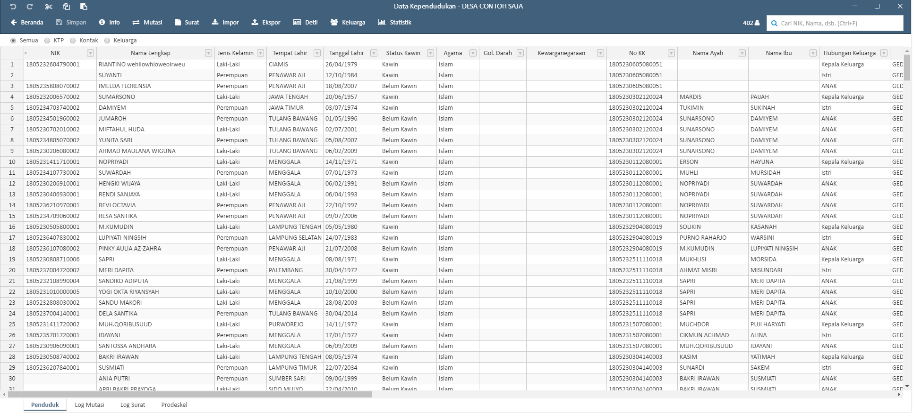
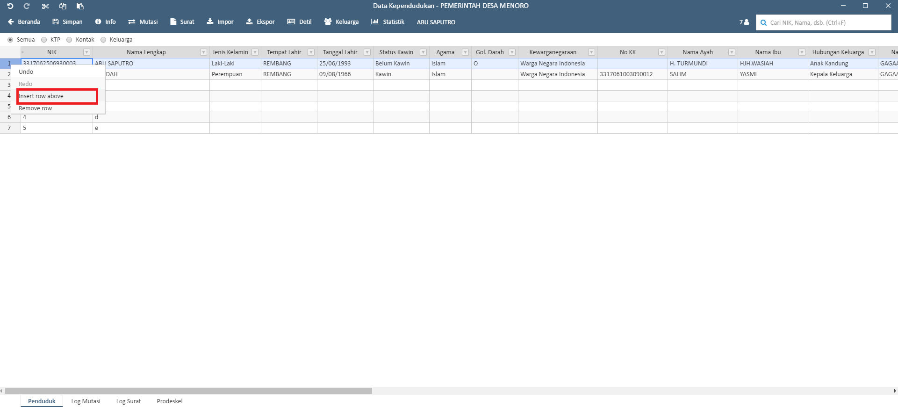
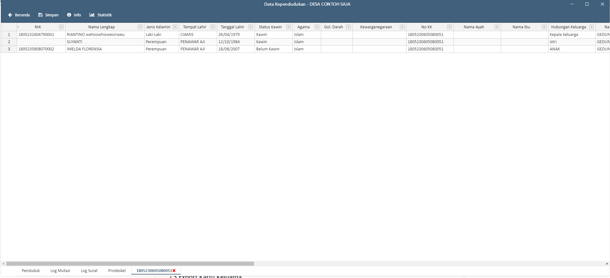
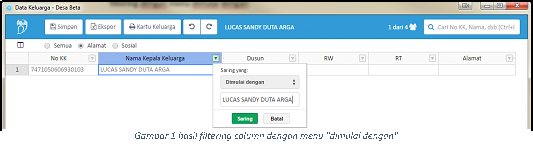

-------------------------
Panduan Sideka Desktop
-------------------------

Installasi aplikasi sideka
==========================

Untuk installasi sideka download terlebih dahulu aplikasi sideka di http://sideka.id, dan klik  **“unduh sekarang”** beikut tampilannya: 

.. figure:: images/sidekadesktop/download-sideka-desktop.png
   :alt: Halaman Download Sideka Desktop
   :align: center
   
   Gambar 1 Halaman Download Sideka Desktop.

Double klik aplikasi sideka yang telah di download, aplikasi akan langsung terbuka dan membuat shortcut pada desktop. berikut tampilan aplikasi sideka:

.. figure:: images/sidekadesktop/halaman-utama-sideka-desktop.png
   :alt: Halaman Utama Sideka Desktop
   :align: center
   
   Gambar 2 Halaman Utama Sideka Desktop.

Untuk membuka kembali sideka dapat meng-klik shortcut aplikasi sideka pada desktop.

Login
=====
Untuk dapat login sideka desktop, username dan password yang digunakan sama dengan username dan password untuk login ke sideka wordpress.  Berikut tampilan halaman login sideka desktop: 

.. figure:: images/sidekadesktop/login-sideka-desktop.png
   :alt: Login Sideka Desktop
   :align: center
   
   Gambar 3 Login Sideka Desktop

Masukan username dan password, dan klik **“log masuk”** untuk login, jika lupa password dapat mengklik **“Kehilangan password Anda?”**, berikut halaman utama sideka jika berhasil login:

   
   Gambar 4 Halaman Administrator Sideka Desktop.
   
Terdapat 4 Modul Utama Pada Sideka Desktop yaitu 
    * Kependudukan
    * Pemetaan
    * Keuangan (Perencanaan, Penganggaran, & Penatausahaan)
    * Pengguna

Kependudukan
========================
Untuk Masuk Ke menu Kependudukan Klik menu “Data Penduduk” pada halaman utama sideka, Berikut Tampilah Halaman Pengelolaan Data Penduduk:

.. figure:: images/sidekadesktop/halaman-pengelolaan-kependudukan.png
   :alt: Halaman Pengelolaan Kependudukan
   :align: center
   
   Gambar 5 Halaman Pengelolaan Kependudukan. 

.. |simpan| image:: images/sidekadesktop/simpan.png
   :scale: 50%
   :align: middle
.. |info| image:: images/sidekadesktop/info.png
   :scale: 50%
   :align: middle

.. |statistik| image:: images/sidekadesktop/statistik.png
   :scale: 50%
   :align: middle
.. |undo| image:: images/sidekadesktop/undo.png
   :scale: 50%
   :align: middle
.. |redo| image:: images/sidekadesktop/redo.png
   :scale: 50%
   :align: middle
.. |cut| image:: images/sidekadesktop/cut.png
   :scale: 50%
   :align: middle
.. |copy| image:: images/sidekadesktop/copy.png
   :scale: 50%
   :align: middle
.. |paste| image:: images/sidekadesktop/paste.png
   :scale: 50%
   :align: middle

|beranda| : Tombol Kembali ke halaman utama.

|simpan| : Untuk Menyimpan Data Penduduk .

|info| : Untuk melihat info file, versi dan perubahan lokal.

|mutasi| : Untuk melakukan mutasi (pindah datang, pindah pergi, kelahiran, kematian) penduduk.

|surat| : Untuk Membuat berbagai surat terkait kependudukan.

|import| : Import Excel data kependudukan dari penyimpanan lokal ke sistem SiDeKa Desktop.

|export| : Export data kependudukan kedalam penyimpanan lokal dalam bentuk excel.

|detil| : Untuk melihat detil data penduduk berdasarkan penduduk yang dipilih.

|keluarga| : Untuk melihat data keluarga penduduk yang masih dalam 1 nomor kartu kerluaga 

|statistik| : Untuk melihat statistik kependudukan dalam satu desa.

|undo| : Undo / Mengembalikan Data ke sebelum di edit 

|redo| : Redo / Mengembalikan Data ke setelah di edit

|cut| : Cut / Memindahkan Data yang dipilh

|copy| : Copy / Menggandakan data yang dipilih 

|paste| : Paste / menempelkan data hasil cut atau copy 

1.1 Import dan Export  data penduduk
------------------------------------

.. |browse| image:: images/sidekadesktop/browse.png
   :scale: 50%
   :align: center

.. |import| image:: images/sidekadesktop/import-berkas-excel.png
   :scale: 50%
   :align: center

Untuk melakukan import data dapat mengklik tanda |browse| atau mengklik tanda |import| Untuk meng-import data dari Microsoft excel, lalu akan diarahkan untuk memilih berkas, berikut tampilan pemilihan berkas yang akan di import: 

.. figure:: images/sidekadesktop/pilih-berkas-data-penduduk.png
   :alt: Halaman Pemilihan Berkas Data Penduduk
   :align: center
   
   Gambar 6 Halaman Pemilihan Berkas Data Penduduk.

Pilih berkas yang akan di import dan klik open untuk mengimport berkas, berikut adalah hasil import dari excel: 

   
   Gambar 7 Tabel Data Penduduk.

Jika sudah melakukan Import data Klik “Simpan” untuk menyimpan data atau berkas.
Data yang telah di import dapat di export  kembali menjadi file dengan format .xlsx, untuk meng- export dapat mengklik tanda |export| yang terdapat pada bagian atas, dan akan muncul halaman untuk menyimpan file seperti berikut:

.. figure:: images/sidekadesktop/simpan-data-penduduk.png
   :alt: Halaman Penyimpanan Berkas Data Penduduk
   :align: center
   
   Gambar 8 Halaman Penyimpanan Berkas Data Penduduk.

Masukan nama file, dan klik **“Save”** untuk menyimpan file

1.2 Tambah data penduduk
------------------------

Untuk menambahkan data penduduk dapat klik kanan pada baris data kependudukan, kemudian pilih **insert row above"** tampilannya seperti berikut: 

   
   Gambar 9 Halaman Tambah Data Penduduk.

Sistem akan menampilkan baris kosong yang kemudian dapat diisi dengan data penduduk baru. Klik tombol **"simpan"** untuk menyimpan perubahan. 

Selain menambahkan data penduduk, data penduduk yang telah ditambahkan dapat dihapus dengan cara blok baris yang akan di hapus lalu klik kanan pada baris tersebut dan klik **“remove row”** untuk menghapus berikut tampilannya: 

.. figure:: images/sidekadesktop/hapus-baris-data-penduduk.png
   :alt: Halaman Hapus Baris Data Penduduk
   :align: center
   
   Gambar 10 Halaman Hapus Baris Data Penduduk.

1.3 Pembuatan surat
-------------------

Pembuatan surat dapat di lakukan dengan cara mengklik data penduduk yang akan dibuatkan surat, dan klik **"surat"** untuk pembuatan surat, berikut tampilannya: 

   
   Gambar 11 Halaman Cara Cetak Surat.

Halaman akan langsung di alihkan ke penyimpanan berkas seperti berikut: 

.. figure:: images/sidekadesktop/browse-cetak-surat.png
   :alt: Halaman Cetak Surat
   :align: center
   
   Gambar 12 Halaman Cetak Surat.

Masukan nama file dan klik **“save”** untuk menyimpan berkas. 

1.4 Filtering dan pencarian data penduduk
-----------------------------------------

Untuk Filtering memiliki 2 cara, cara yang pertama dapat  mengklik  tombol ktp, kontak, keluarga atau kompetensi yang terdapat pada bagian atas. Berikut tampilan untuk filtering berdasarkan kontak: 

.. figure:: images/sidekadesktop/tombol-filtering.png
   :alt: Halaman Filering Dengan Tombol
   :align: center
   
   Gambar 13 Halaman Filering Dengan Tombol.

Cara yang kedua yaitu dapat mengklik pada kolom header, berikut contoh dalam melakukan filter berdasarkan no kepala keluarga yang sama: 

.. figure:: images/sidekadesktop/filtering-dengan-kolom.png
   :alt: Filtering Data Penduduk Dengan Kolom
   :align: center
   
   Gambar 14 Filtering Data Penduduk Dengan Kolom.

Klik sama dengan da nisi value dengan no kk yang akan di filter dan klik “saring”, berikut hasil dan contohnya:

.. figure:: images/sidekadesktop/filtering-dengan-kolom-samadengan.png
   :alt: Filtering Kolom dengan "sama dengan"
   :align: center
   
   Gambar 15 Filtering Kolom dengan "sama dengan".

Untuk melakukan pencarian pada data penduduk dapat memasukan kata kunci pada  kolom pencarian yang terdapat pada pojok kanan atas dan tekan “Enter” pada keyboard untk mencari, berikut adalah tampilannya: 

.. figure:: images/sidekadesktop/cari-data-penduduk.png
   :alt: Pencarian Data Penduduk
   :align: center
   
   Gambar 16 Pencarian Data Penduduk.

Pengelolaan data keluarga
=========================
Untuk Masuk ke menu Pengelolaan data keluarga dapat mengklik menu “Data Keluarga” pada halaman utama sideka, berikut tampilan dan penjelasan masing-masing menu pada halaman data keluarga: 

   
   Gambar 17 Halaman Pengelolaan Data Keluarga.

.. |simpan| image:: images/sidekadesktop/simpan.png
   :scale: 50%
   :align: center

.. |undo| image:: images/sidekadesktop/undo.png
   :scale: 50%
   :align: center
.. |redo| image:: images/sidekadesktop/redo.png
   :scale: 50%
   :align: center

|home| : Tombol Kembali ke halaman Administrator 

|simpan| : Untuk Menyimpan Data Keluarga

|kartukeluarga| : Untuk Membuat Salinan Kartu Keluarga

|undo| : Undo / Mengembalikan Data ke sebelum di edit 

|redo| : Redo / Mengembalikan Data ke setelah di edit

|export| : Export Excel

1.5 Export Kartu Keluarga
-------------------------
Untuk meng-export data keluarga menjadi file dengan ekstensi .xlsx dapat mengklik **"export"** dan akan muncul halaman untuk menyimpan file, berikut tampilannya: 

   
   Gambar 18 Halaman Penyimpanan Berkas Data Keluarga.

Masukan nama File pada kolom file name, dan klik **“save”** untuk menyimpan file.

1.6 Pembuatan Kartu Keluarga
----------------------------
Pembuatan Kartu keluarga tidak berbeda seperti pembuatan surat, yaitu dengan klik data penduduk lalu klik **"Kartu Keluarga"** untuk membuat Salinan kartu keluarga, berikut tampilannya:

   
   Gambar 19 Halaman Pembuatan Kartu Keluarga.

Halaman penyimpanan berkas akan muncul seperti saat pembuatan surat atau export kartu keluarga, masukan file name dan klik **“save”* untuk menyimpan.

1.7 Filtering Dan Pencarian Data Keluarga
-----------------------------------------
filtering data keluarga memiliki 2 cara yaitu dengan cara mengklik tombol semua, alamat dan sosial, berikut adalah contoh filtering kartu keluarga berdasarkan alamat: 

   
   Gambar 20 Filtering Tabel Data Keluarga Dengan Tombol.

cara yang kedua yaitu dengan cara mengklik tanda panah pada bagian samping header, berikut contoh filtering dengan menu dimulai dengan: 

   
   Gambar 21 Filtering Kolom Data Keluarga dengan Menu "Dimulai Dengan".

Berikut adalah hasilnya: 

   
   Gambar 22 Hasil Filtering Kolom Data Keluarga dengan Menu "Dimulai Dengan".

Untuk melakukan pencarian pada data keluarga dapat memasukan kata kunci pada  kolom pencarian yang terdapat pada pojok kanan atas dan tekan “Enter” pada keyboard untk mencari, berikut adalah tampilannya: 

   
   Gambar 23 Pencarian Data Keluarga.

Pengelolaan APBDes
==================
Untuk melakukan pengelolaan data APBDes dapat mengklik menu “APBDes” pada halaman utama sideka. Jika apbdes belum pernah dibuat maka akan muncul halaman pembuatan apbdes seperti berikut :

   
   Gambar 24 Halaman Pengelolaan APBDes.

Klik “Buat APBDes Baru” Masukan tahun apbdes yang akan dibuat pada halaman seperti berikut: 

   
   Gambar 25 Halaman Penambahan Tahun Anggaran APBDes.

Masukan tahun anggaran dan centang jika apbdes merupakan apbdes perubahan, klik “mulai buat apbdes” untuk membuat apbdes. Berikut adalah halaman awal pembuatan apbdes:

   
   Gambar 26 Halaman Pengelolaan Data APBDes.

Berikut adalah penjelasan masing-masing menu pada halaman apbdes:

.. |simpan| image:: images/sidekadesktop/simpan.png
   :scale: 50%
   :align: center

.. |undo| image:: images/sidekadesktop/undo.png
   :scale: 50%
   :align: center
.. |redo| image:: images/sidekadesktop/redo.png
   :scale: 50%
   :align: center
.. |cut| image:: images/sidekadesktop/cut.png
   :scale: 50%
   :align: center
.. |copy| image:: images/sidekadesktop/copy.png
   :scale: 50%
   :align: center
.. |paste| image:: images/sidekadesktop/paste.png
   :scale: 50%
   :align: center

|home| : Tombol Kembali ke halaman Administrator 

|tambah| : Untuk menambahkan detail baru 

|simpan| : Untuk Menyimpan Data APBDes

|surat| : Untuk Membuat Surat

|undo| : Undo / Mengembalikan Data ke sebelum di edit 

|redo| : Redo / Mengembalikan Data ke setelah di edit

|cut| : Cut / Memindahkan Data yang dipilh

|copy| : Copy / Menggandakan data yang dipilih 

|paste| : Paste / menempelkan data hasil cut atau copy 

|import| : Import Excel

|export| : Export Excel

|apbdes| : Memilih Tahun anggaran APBDes

1.8 Penambahan Tahun Anggaan dan Detail Apbdes
----------------------------------------------
Untuk menambahkan tahun anggaran klik dan pilih **“Buat APBDes Baru”**, berikut tampilannya: 

   
   Gambar 27 Cara Pembuatan dan Pemilihan APBDes.

Selanjutnya masukan tahun anggaran seperti pada gambar tambah APBDes baru.
Untuk menambahkan Detail Apbdes dapat mengklik tanda **"tambah"**,halaman penambahan akan keluar seperti berikut:

   
   Gambar 28 Form Penambahan Detail APBDes.

Masukan Kode rekening, Uraian, Jumlah, Dan Keterangan. Jika detail yang dimasukan merupakan sub detail atau rincian maka centang “ini merupakan rincian anggaran yang tidak berkode rekening.

1.9 Import dan Export APBDes
----------------------------
Untuk Import Apbdes dapat mengklik tombol **"browse"**, kemudian pilih berkas seperti gambar berikut: 

   
   Gambar 29 Halaman Pemilihan Berkas APBDes.

Pilih berkas dan klik open untuk import Apbdes, selanjutnya klik **"save"** untuk menyimpan APBDes.
Untuk Export Apbdes menjadi file dengan format  .xlsx dapat mengklik **"export"** dan pilih lokasi penyimpanan, seperti berikut:

.. figure:: images/sidekadesktop/simpan-berkas-apbdes.png
   :alt: Halaman Penyimpanhan Berkas APBDes
   :align: center
   
   Gambar 30 Halaman Penyimpanhan Berkas APBDes.

indikator TPB