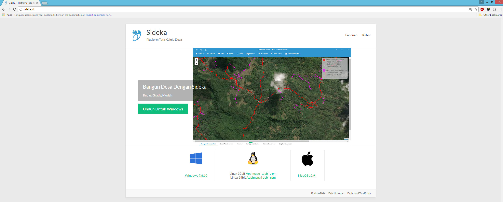
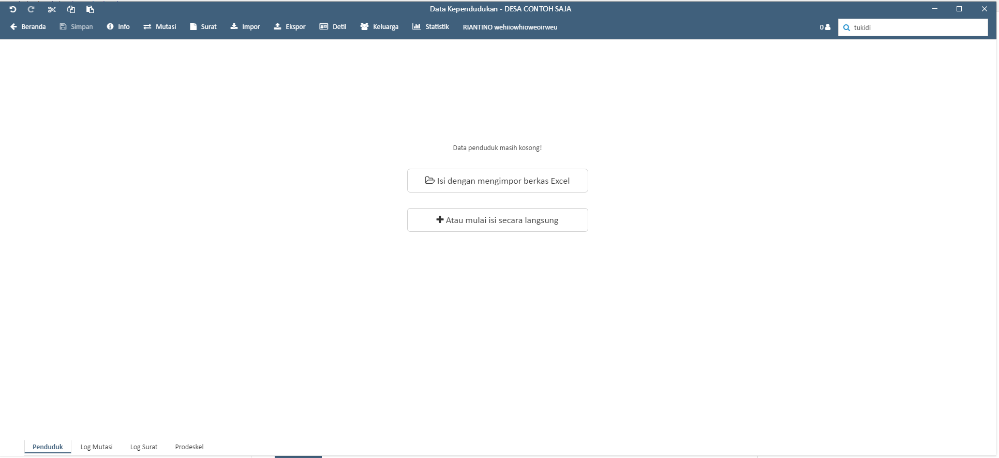
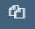
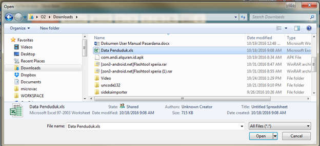
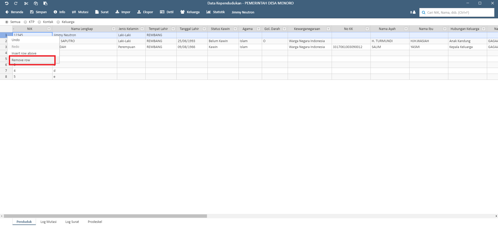
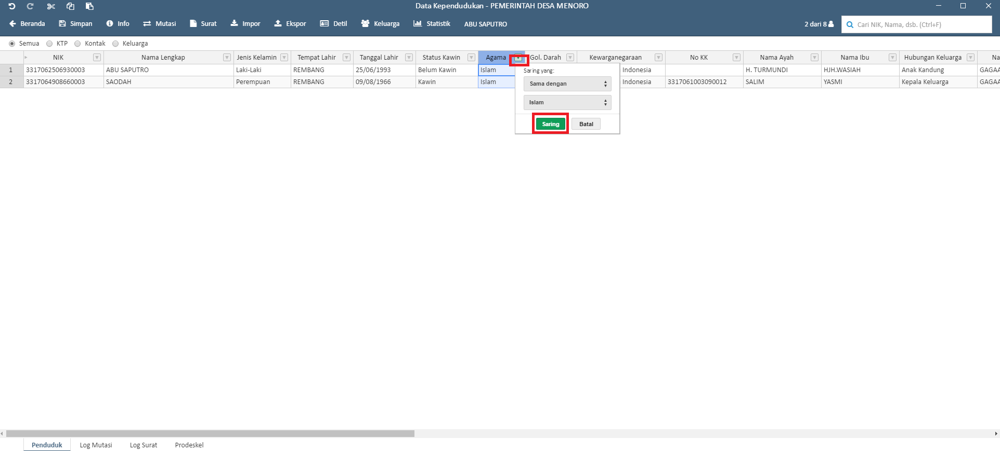

Installasi aplikasi sideka
==========================

Untuk installasi sideka download terlebih dahulu aplikasi sideka di http://sideka.id, dan klik  **“unduh sekarang”** beikut tampilannya: 

   
   Gambar 1 Halaman Download Sideka Desktop.

Double klik aplikasi sideka yang telah di download, aplikasi akan langsung terbuka dan membuat shortcut pada desktop. berikut tampilan aplikasi sideka:

   
   Gambar 2 Halaman Utama Sideka Desktop.

Untuk membuka kembali sideka dapat meng-klik shortcut aplikasi sideka pada desktop.

Login
=====
Untuk dapat login sideka desktop, username dan password yang digunakan sama dengan username dan password untuk login ke sideka wordpress.  Berikut tampilan halaman login sideka desktop: 

.. figure:: images/sidekadesktop/login-sideka-desktop.png
   :alt: Login Sideka Desktop
   :align: center
   
   Gambar 3 Login Sideka Desktop

Masukan username dan password, dan klik **“log masuk”** untuk login, jika lupa password dapat mengklik **“Kehilangan password Anda?”**, berikut halaman utama sideka jika berhasil login:

.. figure:: images/sidekadesktop/halaman-administrator-sideka-desktop.png
   :alt: Halaman Administrator Sideka Desktop
   :align: center
   
   Gambar 4 Halaman Administrator Sideka Desktop.

Pengelolan data penduduk
========================
Untuk Masuk Ke menu Pengelolaan data penduduk Klik menu “Data Penduduk” pada halaman utama sideka, Berikut Tampilah Halaman Pengelolaan Data Penduduk:

   
   Gambar 5 Halaman Pengelolaan Kependudukan. 

.. |home| image:: images/sidekadesktop/home.png    
   :scale: 50%
   :align: center
.. |tambah| image:: images/sidekadesktop/tambah.png
   :scale: 50%
   :align: center

.. |surat| image:: images/sidekadesktop/surat.png
   :scale: 50%
   :align: center
.. |undo| image:: images/sidekadesktop/undo.png
   :scale: 50%
   :align: center
.. |redo| image:: images/sidekadesktop/redo.png
   :scale: 50%
   :align: center

.. |paste| image:: images/sidekadesktop/paste.png
   :scale: 50%
   :align: center
.. |import| image:: images/sidekadesktop/import.png
   :scale: 50%
   :align: center
.. |export| image:: images/sidekadesktop/export.png
   :scale: 50%
   :align: center

|home| : Tombol Kembali ke halaman Administrator 

|tambah| : Untuk menambahkan baris baru 

|simpan| : Untuk Menyimpan Data Penduduk 

|surat| : Untuk Membuat Surat

|undo| : Undo / Mengembalikan Data ke sebelum di edit 

|redo| : Redo / Mengembalikan Data ke setelah di edit

|cut| : Cut / Memindahkan Data yang dipilh

|copy| : Copy / Menggandakan data yang dipilih 

|paste| : Paste / menempelkan data hasil cut atau copy 

|import| : Import Excel

|export| : Export Excel

1.1 Import dan Export  data penduduk
------------------------------------

.. |browse| image:: images/sidekadesktop/browse.png
   :scale: 50%
   :align: center

.. |import| image:: images/sidekadesktop/import-berkas-excel.png
   :scale: 50%
   :align: center

Untuk melakukan import data dapat mengklik tanda |browse| atau mengklik tanda |import| Untuk meng-import data dari Microsoft excel, lalu akan diarahkan untuk memilih berkas, berikut tampilan pemilihan berkas yang akan di import: 

   
   Gambar 6 Halaman Pemilihan Berkas Data Penduduk.

Pilih berkas yang akan di import dan klik open untuk mengimport berkas, berikut adalah hasil import dari excel: 

.. figure:: images/sidekadesktop/tabel-data-penduduk.png
   :alt: Tabel Data Penduduk
   :align: center
   
   Gambar 7 Tabel Data Penduduk.

Jika sudah melakukan Import data Klik “Simpan” untuk menyimpan data atau berkas.
Data yang telah di import dapat di export  kembali menjadi file dengan format .xlsx, untuk meng- export dapat mengklik tanda |export| yang terdapat pada bagian atas, dan akan muncul halaman untuk menyimpan file seperti berikut:

   
   Gambar 8 Halaman Penyimpanan Berkas Data Penduduk.

Masukan nama file, dan klik **“Save”** untuk menyimpan file

1.2 Tambah data penduduk
------------------------

Untuk menambahkan data penduduk dapat mengklik tanda **"tambah"**  dan baris akan muncul atau seperti berikut: 

.. figure:: images/sidekadesktop/tambah-baris-data-penduduk.png
   :alt: Halaman Penambahan Baris Data Penduduk
   :align: center
   
   Gambar 9 Halaman Penambahan Baris Data Penduduk.

Masukan data pada kolom yang kosong atau mucul, dan klik **"simpan"** untuk menyimpan data yang telah ditambahkan. 

Selain menambahkan data penduduk, data penduduk yang telah ditambahkan dapat dihapus dengan cara blok baris yang akan di hapus lalu klik kanan pada baris tersebut dan klik **“remove row”** untuk menghapus berikut tampilannya: 

   
   Gambar 10 Halaman Hapus Baris Data Penduduk.

1.3 Pembuatan surat
-------------------

Pembuatan surat dapat di lakukan dengan cara mengklik data penduduk yang akan dibuatkan surat, dan klik **"surat"** untuk pembuatan surat, berikut tampilannya: 

.. figure:: images/sidekadesktop/cetak-surat.png
   :alt: Halaman Cara Cetak Surat
   :align: center
   
   Gambar 11 Halaman Cara Cetak Surat.

Halaman akan langsung di alihkan ke penyimpanan berkas seperti berikut: 

.. figure:: images/sidekadesktop/browse-cetak-surat.png
   :alt: Halaman Cetak Surat
   :align: center
   
   Gambar 12 Halaman Cetak Surat.

Masukan nama file dan klik **“save”** untuk menyimpan berkas. 

1.4 Filtering dan pencarian data penduduk
-----------------------------------------

Untuk Filtering memiliki 2 cara, cara yang pertama dapat  mengklik  tombol ktp, kontak, keluarga atau kompetensi yang terdapat pada bagian atas. Berikut tampilan untuk filtering berdasarkan kontak: 

.. figure:: images/sidekadesktop/tombol-filtering.png
   :alt: Halaman Filering Dengan Tombol
   :align: center
   
   Gambar 13 Halaman Filering Dengan Tombol.

Cara yang kedua yaitu dapat mengklik pada kolom header, berikut contoh dalam melakukan filter berdasarkan no kepala keluarga yang sama: 

.. figure:: images/sidekadesktop/filtering-dengan-kolom.png
   :alt: Filtering Data Penduduk Dengan Kolom
   :align: center
   
   Gambar 14 Filtering Data Penduduk Dengan Kolom.

Klik sama dengan da nisi value dengan no kk yang akan di filter dan klik “saring”, berikut hasil dan contohnya:

   
   Gambar 15 Filtering Kolom dengan "sama dengan".