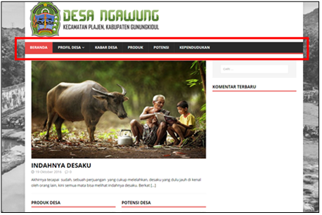
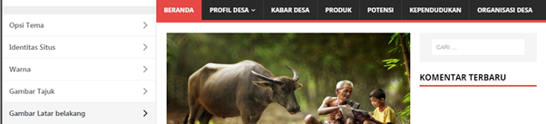
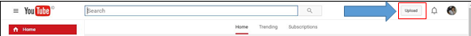

Panduan Sideka Web
==================================

Halaman Utama Web Desa
------------------------------
Untuk dapat melihat halaman utama sideka, masukan url desa pada browser (mozila firefox, google chrome, dll). Berikut adalah tampilan laman utama:

   Gambar 1 Halaman Utama Sideka

Pada halaman utama sideka terdapat menu utama yaitu:

**a. Beranda**
     Beranda berisi ringkasan tentang postingan berita dengan 3 kategori, yaitu kabar desa, produk dan potensi desa. 
**b. Profil Desa**
     Pada menu Profil Desa berisi sub menu Sejarah desa dan Lembaga Desa, sub menu sejarah desa menjelaskan sejarah desa terbentuk dan lembaga desa berisi lembaga lembaga yang        terdapat di desa.
**c. Kabar Desa**
     Kabar Desa Berisi Berita yang telah di posting, berisikan berita-berita tentang kejadian atau informasi dari desa.
**d. Produk**
   Menu produk desa berisikan semua postingan berita yang berhubungan dengan produk desa atau postingan dengan kategori produk desa.
**e. Potensi**
     Menu potensi desa berisikan postingan berita yang berhubungan dengan potensi yang terdapat desa.
**f. Kependudukan**
     Menu kependudukan berisi statistika Penduduk dengan berdasarkan data penduduk yang terdapat pada desa.

Login Wordpress
-------------------
Buka domain nama desa yang telah dibuat pada browser,contoh http://namadesa.desa.id lalu klik **“Log Masuk”** pada halaman paling bawah sideka atau seperti gambar beikut:

.. figure:: images/sidekaweb/log-masuk.png
   :alt: Log Masuk
   :align: center
   
   Gambar 2 Halaman Log Masuk Sideka.

Pengguna Dapat juga mengakses dengan memasukan domain dan di tambahkan “/wp-admin” atau “/wp-login” sebagai contoh: “http://namadomain.desa.id/wp-admin”. Selanjutnya  masukan username dan password pada halaman form login dan klik “Log Masuk” untuk login, berikut Tampilannya:

.. figure:: images/sidekaweb/administrator-form-login.png
   :alt: Form Login Aministrator
   :align: center
   
   Gambar 3 Halaman Form Login Administrator

Berikut Tampilan Dashboard Adminisitrator jika telah sukses login:
 
.. figure:: images/sidekaweb/dashboard-administrator.png
   :alt: Dashboard Administrator
   :align: center

   Gambar 4 Halaman Dashboard Administraor

Lupa Password
---------------------
Kehilangan password atau lupa password dapat mengklik “kehilangan password Anda?” pada halam login atau seperti berikut:

.. figure:: images/sidekaweb/lupa-password.png
   :alt: Halaman Lupa Password
   :align: center

   Gambar 5 Halaman Lupa Password

Selanjutnya, masukan email pada form  **“Halaman Pengguna Atau Email”** dan klik **“Dapatkan Password Baru”** atau seperti berikut:

   Gambar 6 Form Lupa Password

Password akan dikirimkan melalui email yang berisi link untuk merubah password.

Posting berita
------------------
Klik menu Pos pada dashboard sideka admin, dan klik **“Tambah Baru”** untuk membuat posting atau berita baru seperti yang ditunjukan pada gambar berikut:

   Gambar 7 Menu Membuat Berita Baru

Halaman akan langsung di alihkan ke halaman berikut:

   Gambar 8 Form Pembuatan Berita Baru

Masukan judul berita dan isi Berita, selanjutnya pilih kategori berita seperti yang ditunjukan pada gambar berikut:

   Gambar 9 Kategori Berita

Centang kotak yang terdapat di sebelah kategori berita. Selanjutnya klik “Buat Gambar utama” untuk menambahkan gambar pada posting berita, berikut tampilannya:

   Gambar 10 Pemilihan Gambar Utama Berita

Halaman akan langsung di alihkan ke halaman gambar fitur untuk pemilihan foto, klik “Pilih Berkas Untuk” Mengunggah foto, seperti yang ditunjukan pada gambar berikut:

   Gambar 11 Form Pemilihan Berkas

selanjutnya klik pilih gambar yang disimpan lalu klik **“open”** untuk memilih gambar, selanjutnya centang pada gambar yang telah kita pilih dan klik “Buat Gambar Utama” atau seperti gambar berikut:

   Gambar 12 Pemilihan gambar pada local directory / Media

Jika form sudah terisi semua selanjutnya klik Terbitkan untuk menerbitkan berit atau seperti gambar berikut:

   Gambar 12 Form Penerbitan Berita

Penyuntingan atau Editing berita
------------------------------------
Penyuntingan Berita Memiliki 2 cara yaitu dengan Sunting Biasa atau Sunting Cepat, pada sunting berita dengan Sunting biasa halaman yang ditampilkan akan seperti membuat berita baru, sedangkan untuk sunting cepat penyuntingan berita tidak di alihkan ke halaman lain melainkan di tempat itu sendiri namun untuk isi berita dari berita tersebut tidak ditampilkan, berikut tampilan mengedit berita dengan cara **“Sunting”** atau **“Sunting Cepat”**:

   Gambar 13 Lokasi Penyuntingan Berita

Berikut tampilan pengeditan berita dengan cara **“sunting cepat”**:

   Gambar 14 Penyuntingan Berita dengan "Sunting Cepat"

Jika sudah melakukan perubahan dapat meng klik “Perbarui”.

Hapus berita
----------------
Untuk melakukan penghapusan penghapusan 1 berita dapat dilakukan dengan cara mengarahkan kursor pada berita yang akan dihapus, lalu Klik “Buang”untuk menghapus berita, untuk berita yang dihapus akan masuk ke tong sampah dan untuk melihatnya dapat mengklik “Tong Sampah” untuk melihat file seperti yang ditunjukan pada gambar berikut:

   Gambar 15 Penghapusan 1 Berita

Untuk melakukan lebih dari 1 berita dapat dilakukan dengan cara, Centang kotak yang berada di samping judul berita, lalu klik **“Tindakan Massal”** selanjutnya pilih **“Pindahkan Ke Tong Sampah”** dan klik **“Terapkan”** untuk Menghapus Berita.

   Gambar 16 Penghapusan 1 Berita

Pencarian berita
------------------------
Untuk pencarian berita, buka menu pos pada halaman admin dan masukan kata kunci pada kolom pencarian lalu klik **“cari pos”** untuk mencari.

   Gambar 17 Form Pencarian Berita

Tambah kategori berita
--------------------------
Penambahan kategori berita dapat dilakukan pada menu **“Pos”** dengan sub menu **“kategori”**, masukan nama kategori, slug, induk dan deskripsi. Pengisian Form cukup memasukan nama dan slug, klik “tambah Kategori Baru” untuk menyimpan kategori yang telah dibuat, Berikut tampilannya:

   Gambar 18 Penambahan Kategori Berita

Membuat halaman
-------------------
Untuk membuat Halam klik “Laman” di menu administrator, lalu klik “Tambah Baru” atau seperti berikut ini:

   Gambar 19 Form Pembuatan Halaman Baru

Isi judul laman dan form-form yang dibuthkan lalu klik “Terbitkan” untuk Menerbitkan halaman, berikut contohnya: 

Untuk membuat Halam klik “Laman” di menu administrator, lalu klik “Tambah Baru” atau seperti berikut ini:

   Gambar 20 Penambahan Halaman Baru

Menampilkan Halaman di Menu
-------------------------------
Untuk menampilkan halaman yang telah dibuat Klik “Tampilan” dan klik sub menu “Menu”. Untuk menampilkan Halaman ke menu, centang halaman yang telah dibuat, lalu klik “Tambahkan ke Menu” berikut Tampilannya:

   Gambar 21 Menampilkan Halaman ke Menu

Jika Laman yang di tambahkan sudah muncul di menu, klik “simpan menu”  untuk menyimpan berikut tampilannya:

.. figure:: images/sidekaweb/struktur-menu.png
   :alt: Tampilan Struktur Menu
   :align: center

   Gambar 22 Tampilan Struktur Menu

berikut adalah hasilnya:

   Gambar 23 Hasil Penambahan Halaman Ke Menu

Menampilkan Posting Berkategori Ke Menu
-----------------------------------------------
Untuk membuat menu baru dengan halaman yang berisikan posting berita dengan kategori yang telah dibuat yaitu:

* Buat kategori berita seperti pada sub bab “Tambah Ketgori Berita”
* Buat berita seperti pada sub menu “Posting Berita” dan tambahkan dengan kategori yang telah dibuat sebelumnya.
* Berikut adalah langkah terakhir untuk menambahkan ke menu:

   Gambar 24 Penambahan Kategori Berita Ke Menu

Mengatur komentar
----------------------
Jika Moderasi Komentar aktif maka setiap komentar yang masuk tidak langsung ditampilkan, tetapi komentar akan masuk terlebih dahulu untuk mendapat persetujuan dari administrator. Untuk mengatur komentar satu persatu arahkan kursor ke komentar sampai menu muncul seperti gambar berikut:

   Gambar 25 Halaman Moderasi Komentar

Maksud dari menu –menu saat cursor diarahkan yaitu:

* Setuju	: Untuk menyetujui pesan agar ditampilkan
* Balas	: Untuk membalas Komentar
* Sunting Cepat: Untuk Mengedit cepat comment
* Sunting : Untuk Melakukan pengeditan dengan dialihkan ke halaman Pengeditan
* Sejarah	: Untuk melihat detail pengirim komentar
* Spam	: Penyalahgunaan komentar yang berisi iklan, undian, informasi palsu, phishing, penipuan, dan lain sebagainya dan dikirim secara beruntun.
* Buang	: Menghapus komentar

Penghapusan atau menyetujui pesan secara masal dapat dengan menandai pesan yang akan di hapus atau di setujui,  klik “tindakan massal” lalu pilih aksi yang akan dilakukan dan setelah itu pilih “terapkan” untuk menyimpan hasil, berikut contohnya:

   Gambar 26 Penindakan Komentar Secara Massal

Mematikan Moderasi Komentar
--------------------------------
Mematikan moderasi komentar memungkinkan setiap orang yang mengirim komentar akan langsung di tampilkan tanpa memerlukan persetujuan dari administrator, untuk mematikan moderasi komentar unchecklist “sebuah komentar ditahan untuk moderasi”, berikut tampilannya:

   Gambar 27 Halaman Pengaturan Diskusi

jika sudah menonaktifkan, scroll ke bawah dan klik “simpan perubahan” untuk menyimpan, berikut tampilannya:

   Gambar 28 Penyimpanan Perubahan Pengaturan Diskusi

Mengganti Logo Web
-----------------------
Untuk mengganti Logo desa caranya adalah klik “Tampilan” lalu pilih  “sesuaikan”, berikut tampilannya:

.. figure:: images/sidekaweb/penyesuaian-tampilan.png
   :alt: Sub Menu Penyesuaian Tampilan
   :align: center

   Gambar 29 Sub Menu Penyesuaian Tampilan

Untuk mengganti header logo desa, dapat mengklik “identitas Situs”.

   Gambar 30 Menu Penggantian Logo

berikut tampilan untuk mengganti logo dan ikon situs:

   Gambar 31 Halaman Penggantian Logo

klik menu “ganti logo” dan akan mucul pop up untuk pemilihan logo, klik  “unggah berkas” dan “pilih berkas” untuk upload logo dari local directory, jika sudah selesai centang foto yang dipilih lalu klik “pilih” berikut tampilannya:

   Gambar 32 Pemilihan Logo Pada Media

jika file telah dipilih, akan muncul pop up “pemangkasan” gambar atau pemotongan gambar,  jika file akan di potong maka pilih “Pemangkasan” jika tidak “lewati pemangkasan” berikut tampilannya:

   Gambar 33 Halaman Pemangkasan Logo

Jika pemangkasan sudah dilakukan langkah selanjutnya menyimpan hasil dan menerbitkan seperti yang ditunjukan pada gambar berikut:

   Gambar 34 Menu Penyimpanan Perubahan

Menganti latar belakang
-----------------------------

Penggantian latar belakang masih dalam menu “Tampilan” dan sub menu “sesuaikan” seperti pada gambar awal penggantian logo, pilih “Gambar Latar Belakang” untuk penggantian background latar belakang:

   Gambar 35 Menu Penggantian Latar Belakang

Pilih seleksi gambar untuk memilih gambar, tampilan untuk pemilihan gambar sama seperti saat upload logo, berikut tampilannya:

   Gambar 36 Halaman Penggantian Latar Belakang

Menganti warna tema
------------------------
Penggantian warna tema dalam menu “Tampilan” dan sub menu “sesuaikan” seperti pada gambar awal penggantian logo, pilih “Warna” untuk penggantian warna:

   Gambar 37 Menu Penggantian Warna

Tipe warna digunakan untuk mengganti warna tema, dan “warna latar belakang” jika latar belakang tidak di set gambar dan klik “Simpan dan Terbitkan” untuk menyimpan, berikut tampilannya: 

   Gambar 38 Halaman Penggantian Warna

Menambahkan pengguna
-------------------------
Penambahan Pengguna dapat dilakukan pada menu “pengguna” dan klik “tambah pengguna” untuk menambahkan pengguna baru, berikut tampilannya:

   Gambar 39 Halaman Penambahan Pengguna Baru

Halaman akan langsung dialihkan seperti pada gambar berikut:

   Gambar 40 Form Penambahan Pengguna Baru

Saat menambahkan pengguna, wajib menambahkan nama, surel (e-mail), pilih Role pengguna, dan selesai, Password akan dikirmkan ke pengguna baru melalui email yang telah di daftarkan.

Mengatur jumlah berita yang ditampilkan
--------------------------------------------
Untuk mengatur jumlah berita yang tampil dapat diatur dengan cara berikut:

   Gambar 41 Halaman Pengaturan Membaca

Menambahkan sosial media ke sidebar
----------------------------------------
Penambahan social media terdapat pada menu “Tampilan” dengan sub menu “Widget” Berikut adalah cara menambahkan halaman facebook ke sidebar: 

   Gambar 42 Halaman Penambahan Plugin Facebook ke sidebar

Klik “Plugin Halaman Facebook” dan isikan judul dan url facebook, tekan simpan untuk menyimpan, berikut tampilannya:

   Gambar 43 Pengisian Form Widget Facebook

Untuk menambahkan lini masa caranya hampir sama dengan menambahkan halaman ke facebook, yaitu tekan, tahan dan pindahkan “Lini Masa Twitter (jetpack)” ke home-6 1/3 width berikut caranya:

   Gambar 44 Halaman Penambahan Lini Masa Twitter ke Sidebar

Masukan judul ke kolom “judlu” dan id twitter ke “nama pengguna twitter” seperti pada gambar berikut:

   Gambar 45 Halaman Pengisian Form Lini Masa

Menyisipkan Video Youtube Ke Dalam Berita
----------------------------------------------
Sebelum menyisipkan video ke berita, pastikan video sudah di upload terlebih dahulu ke youtube, berikut cara upload ke youtube:

1. Sign in ke youtube

   Gambar 46 Form Sign In Youtube

2. Klik “upload”

   Gambar 47 Menu Upload Youtube

3. Pilih Berkas

   Gambar 48 Form Pemilihan Berkas

4. Publish Video

   Gambar 49 Proses Upload Youtube

5. Copy url

.. figure:: images/sidekaweb/copy-url.png
   :alt: Upload Done
   :align: center

   Gambar 50 Upload Done

6. Paste Url Pada Isi Berita.

   Gambar 51 Halaman Pembuatan Berita